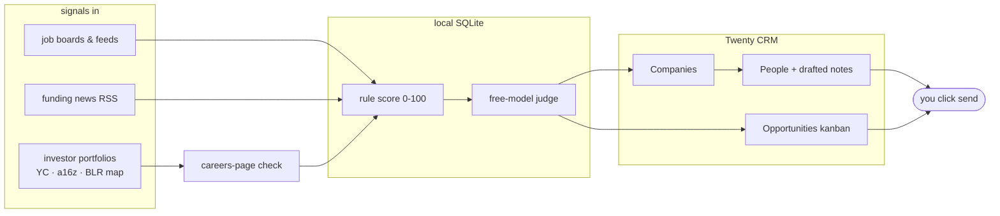
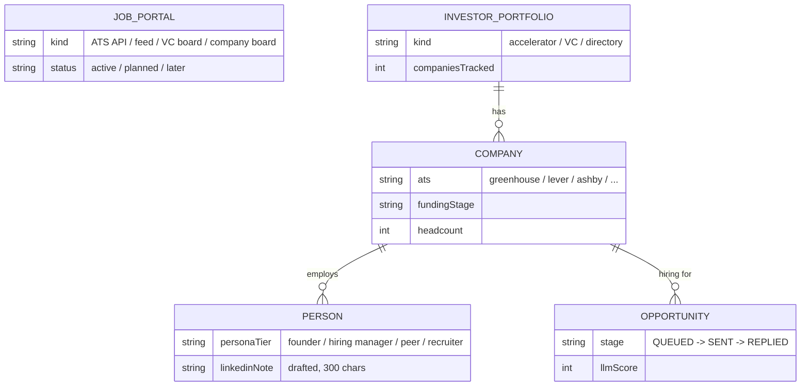

# job-hunt

A job-search pipeline that runs on free tiers. It watches two signals — job postings that
match your profile, and freshly funded companies at the size where founders still hire
directly — and turns them into a CRM full of companies, people, and drafted outreach.
Nothing sends itself: you review every connect note and email before it goes out.

Clone it and run your own hunt. Your profile, CV, and all results stay local and gitignored.

## Quickstart

Three installs first, all free: [git](https://git-scm.com/downloads),
[Node.js](https://nodejs.org) 20+, and [Docker Desktop](https://www.docker.com/products/docker-desktop/)
(runs the CRM on your machine). Then:

```bash
git clone https://github.com/0xSarnavo/job-hunt && cd job-hunt
npm install && npm link          # makes `jobhunt` available everywhere
cp .env.example .env             # add the keys you have; a missing key only disables its step
npm run crm-up                   # your CRM, on your machine: http://localhost:3010
jobhunt setup                    # reads your CV, drafts profile.yaml, asks the rest
jobhunt daily                    # then this, once a day
bash scripts/install-daily.sh    # ...or run this once and never think about it again
```

First visit to http://localhost:3010: create an account (that's a login for your own
private CRM, not a signup anywhere), then Settings → APIs → generate a key → paste it
into `.env` as `TWENTY_API_KEY`, and run `npm run setup-crm` once to build the data model.

`jobhunt` alone shows a menu. The verbs:

| verb | does |
|---|---|
| `jobhunt setup` | first run: CV → drafted `profile.yaml` → short interview → checks |
| `jobhunt check` | verifies keys, LLM CLIs, DB, CRM data model; every ✗ names its fix |
| `jobhunt daily` | runs the whole pipeline |
| `jobhunt people` | finds more people to reach (`--max 50` for a bigger batch) |
| `jobhunt add` | guided form: log a connection (`add person`) or a role you found (`add role`) |
| `jobhunt status` | progress bars, counts, and what's pending |

## How it works



Postings get a deterministic rule score (title, keywords, location, freshness), then a free
LLM judges everything the rules liked. Double-passed roles land on a kanban in
[Twenty](https://twenty.com); the pipeline then finds founders and hiring managers at those
companies and drafts a connect note and DM for each. Funded companies without a matching
posting become pitch targets instead.

## Daily run order

Script numbers are build order, not run order. `scripts/run-daily.sh` runs them like this:

| # | script | does |
|---|---|---|
| 1 | `1-fetch` | pulls postings from every portal, including boards you add in the CRM |
| 2 | `7-funded` | funding RSS (US · UK · EU · India · AU) → enrich → 5–50 headcount pitch targets |
| 3 | `14-backfill` | walks 2 years of funding archives, one bounded chunk per day |
| 4 | `11-vc-companies` | newest YC batches → pitch targets |
| 5 | `12-portfolios` | investor programs + their member companies → CRM |
| 6 | `16-crm-pull` | absorbs records you added in the CRM by hand |
| 7 | `13-careers` | detects each portfolio company's ATS; re-scans known boards weekly |
| 8 | `15-feedback` | pulls your irrelevant-marks so the judge learns your taste |
| 9 | `2-llm-score` | free-model judge on new matches |
| 10 | `3-cv-briefs` | CV-tailoring brief per double-passed job → `data/cv-briefs/` |
| 11 | `4-sync` | matched jobs → CRM kanban |
| 12 | `5-people` | people per company: Fiber profiles first, web search fallback |
| 13 | `6-emails` | email waterfall, only for people you marked `Fetch Email = YES` |
| 14 | `8-followups` | drafts follow-ups for stale SENT cards |
| 15 | `9-connect-list` | regenerates `data/connect-list.md` |
| 16 | `10-usage-sync` | per-vendor API usage counters → CRM |

The run ends with a CRM database backup (`data/crm-backup-Mon.sql.gz` … `Sun`, a rolling week).
Any step that stops at a cap or quota writes what's left, and why, to `data/PENDING.md`.

### Set-and-forget

`bash scripts/install-daily.sh` schedules the pipeline on macOS (prints the cron line on
Linux). Not a fixed hour: it runs once per day, the first time your machine is awake after
8 AM — open the laptop at 11, it runs by 11:30. The wrapper (`scripts/daily-if-due.sh`)
handles the failure cases so you don't have to:

- If Docker isn't running, the script starts it and waits.
- If one source is down, the other steps still run; failures are listed at the end of
  `data/daily-cron.log`.
- A step that hangs is killed at its time cap instead of blocking the day.
- If 4+ steps fail (network down, machine slept mid-run), the day stays unstamped and the
  whole run retries on the next half-hour tick — at most 3 attempts per day.

Everything is incremental and safe to re-run: a retried or manual `jobhunt daily` picks up
where the last one stopped instead of duplicating work.

### It gets faster on its own

Heavy work is front-loaded and drains itself: the archive backfill keeps a resume cursor per
feed until it reaches the 2-year mark, first-time careers checks are cached forever, and each
finished backlog frees the daily run for cheap freshness work: known boards re-scan on a
weekly rotation (oldest first, ~80/day), so a company that starts hiring your roles next
month gets caught without you doing anything. Day one is slow. A month in, `jobhunt daily`
is mostly quick re-scans of the newest data.

## The CRM

The pipeline's front end is [Twenty](https://twenty.com), an open-source CRM you host
yourself. `docker-compose.crm.yml` runs it on your machine:

```bash
npm run crm-up      # start — http://localhost:3010, ready in ~30s
npm run crm-down    # stop — all data survives in docker volumes
```

You log in once; the session is configured to last years. Start it when you want to look,
stop it when you don't — the daily run starts it by itself when needed.

Hosting it in the cloud (Railway, a VPS) works too — set `TWENTY_URL` to your instance —
but for one person checking a dashboard it's paying for a server that idles 23 hours a day,
and it puts your job-search data on someone else's machine. Local costs nothing. If you do
host it: put it behind HTTPS, use a strong password, and treat the API key like a password.

`npm run setup-crm` builds five objects (plus an API-usage tracker) in that Twenty:



Portal status legend: **Active** = fetched every run. **Planned** = adapter exists; flip the
status in the CRM to start it. **Later** = blocked by something real (login walls, account
risk); `docs/SOURCES.md` says what.

The CRM is an input too, not only a mirror:

- Add a **Job Portal** (Kind = VC Board, Status = Active, plus a URL) and the next `1-fetch`
  parses that page like any built-in source.
- Add an **Investor Portfolio** with a URL and the next `12-portfolios` extracts its company
  list and links the companies to your record. Sites that need a real parser get one in
  `src/registry.ts` + `scripts/12-portfolios.mts`; the YC, a16z, and Bangalore-map blocks
  are the templates.
- `13-careers` adds every ATS board it discovers as a Company Board portal, so your watchlist
  grows by itself.
- Use **+ New** on Companies, People, or Opportunities freely: `16-crm-pull` absorbs anything
  without an Actor into the pipeline each run — companies get careers-checked (yours first),
  people get a persona tier, roles get scored. `jobhunt add` does the same from the terminal
  with a guided form.

## Make it yours

- **Your roles, locations, dealbreakers** live in `profile.yaml` — `jobhunt setup` writes
  it by interviewing you, or edit it directly. The rule score and the LLM judge both read
  it, so changing it re-aims the whole pipeline.
- **A specific page you want watched** (a company's careers page, a VC's job board, a
  portfolio list): add it in the CRM as a Job Portal or Investor Portfolio with a URL —
  see "The CRM is an input too" above. No code needed for most pages.
- **A site that needs a real parser** gets one in `src/registry.ts` +
  `scripts/12-portfolios.mts`; copy the YC or a16z block and change the URL and selectors.
- **Batch sizes, caps, models**: every script opens with a Knobs block, overridable from
  `.env` (list at the bottom of this file).

## Security

- **What stays on your machine**: your profile, CV, the SQLite DB, the CRM and its
  database, every draft, every backup. All of it is gitignored — a `git push` of this
  repo can't leak it.
- **What leaves your machine**: job-board queries and company-name lookups go to the APIs
  you gave keys for (that's what the keys are for). Postings and public profile data come
  back. Your CV never goes to any vendor; only the LLM CLI you configured reads it.
- **`.env` is the one file to protect** — it holds every key. It's gitignored; keep it
  out of screenshots and pastebins. Any key can be revoked and reissued at its vendor if
  it leaks.
- **Nothing sends itself.** Emails become Gmail drafts, connect notes become a list.
  A bug in this pipeline can waste API quota; it cannot message a founder as you.
- **The CRM login** is your own instance's account, stored in your own database — it
  exists so the API needs a key, not because anyone else can see the data.

## What's free, what's optional

Everything degrades instead of failing:

- **LLM calls** shell out to whatever CLI you have. Defaults: `opencode run` (free models)
  for extraction, `claude -p` for judgement. Point `LLM_LIGHT` / `LLM_HEAVY` in `.env` at
  any prompt-taking CLI. A step that can't reach a model skips its items and moves on.
- **Each API key unlocks one step** (`.env.example` lists them). No key, no step, rest of
  the pipeline unaffected.
- **People profiles** come from Fiber's free tier (10,000 pulls/month); email discovery uses
  a waterfall of free-tier vendors with results cached forever.
- **No CRM configured?** SQLite still holds everything.

## Folders

```
docs/         PLAN.md (the spec) · SOURCES.md (every source + status) · TOOLING.md (tool choices)
src/          shared library: db, llm, scoring, resolver, sources/, CRM setup & sync, registry
scripts/      numbered pipeline steps + run-daily.sh, daily-if-due.sh, install-daily.sh
docker-compose.crm.yml   the CRM stack (Twenty + Postgres + Redis), `npm run crm-up`
data/         generated & personal, all gitignored: jobhunt.db, cv-briefs/, email-drafts/,
              connect-list.md, portfolio-companies.md, PENDING.md, LINKS.md
profile.yaml  your profile (gitignored) — written by `jobhunt setup`
.env          your keys (gitignored) — copy .env.example
```

The split that matters for a public repo: `src/registry.ts` (which portals and programs the
pipeline follows) is tracked. The results (companies, people, roles, drafts, your profile)
never leave `data/`, `profile.yaml`, and your CRM.

## Knobs

Every script opens with a Knobs block (batch sizes, models, caps). Env overrides:
`LLM_LIGHT`, `LLM_HEAVY`, `JOBHUNT_DB`, `PORTFOLIO_YC_SINCE`, `PORTFOLIO_PUSH_MAX`,
`CAREERS_PER_RUN`, `CAREERS_RESCAN`, `PEOPLE_PER_RUN`, `BACKFILL_DAYS`, `VC_QUERIES`.
